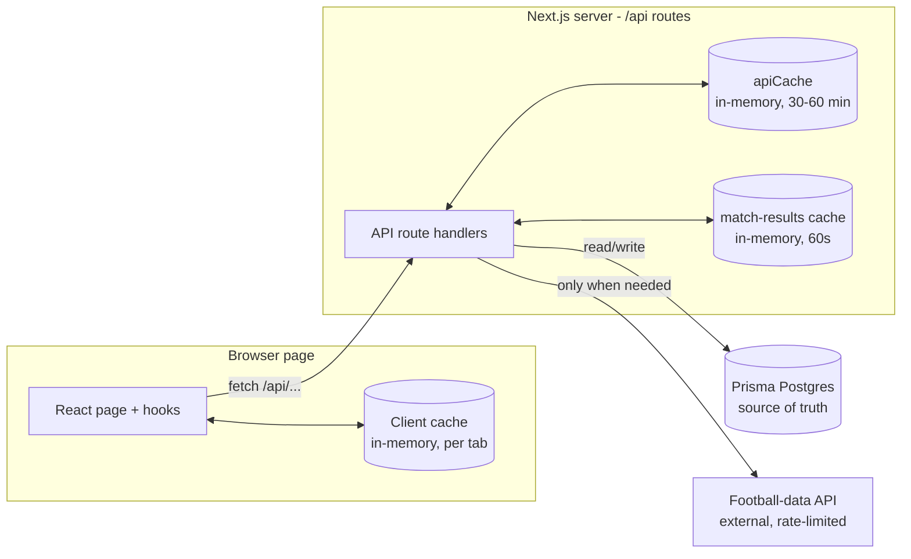
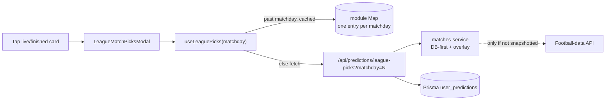

# Data Flow: Matches Tab

This document explains **how data moves through the app** for the **Matches
tab** — what happens when the matches page loads, where data is fetched from,
and how the various caches are used. It is written for **two audiences**:

- **Plain-English** explanations for anyone (no coding background needed).
- **🔧 Engineer notes** (call-out blocks) with the technical detail.

> **Other tabs:** Account, Standings, and Admin are covered in
> [`DATA_FLOW_OTHER_TABS.md`](./DATA_FLOW_OTHER_TABS.md). The caching layers and
> "why internal endpoints" sections below apply app-wide.

---

## TL;DR

When you open the app, the page (running in your browser) asks the app's **own**
web address for data — never the football provider directly. Those internal
addresses (called **API routes**) do the real work: they check a series of
short-term memories (**caches**) first, and only reach out to the **football
data provider** or the **database** when they have to. Finished match results
increasingly come from **our own database**, which we treat as the source of
truth because the football provider's free feed is sometimes stale.

---

## The cast (plain-English glossary)

| Piece                               | What it is                                          | Real-world analogy           |
| ----------------------------------- | --------------------------------------------------- | ---------------------------- |
| **Browser page**                    | The screen you see; runs the React app              | A customer at a counter      |
| **Internal API route** (`/api/...`) | The app's own back-end endpoints                    | The staff behind the counter |
| **Football-data API**               | External provider of fixtures & scores              | A supplier in another city   |
| **Database** (Prisma Postgres)      | Our permanent store of predictions, points, results | The stockroom / ledger       |
| **Cache**                           | Short-term memory that avoids repeat work           | A fridge behind the counter  |

> 🔧 **Engineer note.** The browser code is a Next.js **client** app
> (`"use client"` components). All external and database access happens **server
> side** inside Next.js **route handlers** under `src/app/api/**`. The client
> talks only to those routes via `fetch`.

---

## Why everything goes through "internal" endpoints

You were unsure how data flows because almost every request goes to our own
`/api/...` address instead of the football provider. That is **on purpose**:

1. **Security** — the football provider requires a secret API key. If the
   browser called the provider directly, that key would be exposed to anyone.
   Keeping the call server-side hides the key.
2. **Browser rules (CORS)** — browsers block most direct cross-site API calls.
   Routing through our own server avoids that.
3. **Control** — going through our own routes lets us add caching, overlay our
   database results, and shape the response.

> 🔧 **Engineer note.** `FOOTBALL_DATA_API_KEY` is read only in server modules
> (`src/lib/matches-service.js`, `src/app/api/matchday/route.js`,
> `src/lib/points.js`). The `X-Auth-Token` header is never sent from the client.

---

## Big picture

The golden rule: **each layer tries its own cache/DB first and only calls the
next layer outward when it must.** The football-data provider (top right) is the
slowest and most limited, so the whole design exists to touch it as little as
possible.

---

## Walkthrough: loading the Matches page

Here is exactly what happens, step by step, when you open the home page.

### 1. The page mounts and checks who you are

The page (`src/app/page.js`) renders and asks the auth system for your session.

- Plain English: the app first figures out whether you're signed in.

> 🔧 **Engineer note.** `useAuth()` (from `AuthProvider`) calls
> `GET /api/auth/session`, which reads the `sessions`/`users` tables via Prisma.
> The global `user.isAdmin` flag comes from here.

### 2. The page asks "which gameweek are we in?"

`useMatches()` calls `getCurrentMatchday()`.

- Plain English: it looks in its own short-term memory first; if empty, it asks
  our server, which also checks its memory, and only then asks the provider.

> 🔧 **Engineer note.** Chain: `getCurrentMatchday()` (client cache in
> `src/lib/cache.js`, TTL **1 hour**) → `GET /api/matchday` → server `apiCache`
> (TTL **1 hour**) → football-data `/competitions/2021`. Returns
> `currentSeason.currentMatchday`.

### 3. The page asks for that gameweek's fixtures

`useMatches()` then calls `getFixturesByMatchday(currentMatchday)`.

- Plain English: same idea — check memory, then our server. Our server has a
  clever shortcut: if it already saved **all** the results for that gameweek in
  our database, it answers straight from the database and never contacts the
  provider.

> 🔧 **Engineer note.** Chain: `getFixturesByMatchday()` (client cache, TTL
> **30 min**) → `GET /api/matches?matchday=N` → `fetchMatchesByMatchday()` in
> `src/lib/matches-service.js`:
>
> 1. **DB-first:** `getCompleteMatchdayFromDb(N)` — if the matchday is complete
>    (`MatchResult` rows == `MatchdayMeta.fixtureCount`), build the response from
>    Prisma and **skip football-data entirely**.
> 2. Otherwise: server `apiCache` (TTL **30 min**) → football-data
>    `/competitions/2021/matches?matchday=N`, then `overlayMatchdayResults()`
>    overlays any saved DB scores (DB wins) and learns the fixture count.
>
> See [`DATA_GAP_STALE_MATCHES.md`](./DATA_GAP_STALE_MATCHES.md) for why the DB
> is authoritative for finished matches.

### 4. The page loads your predictions

`usePredictions(user)` loads the picks you've made.

- Plain English: your saved scores are read from the database so the page can
  show them and lock the ones whose matches already kicked off.

> 🔧 **Engineer note.** `predictionsService` → `GET /api/predictions?userId=…`
> (guarded by `canActAsUser`) → Prisma `user_predictions`. The hook also manages
> an **offline retry queue** (localStorage) and re-syncs on reconnect via
> `useNetworkStatus`.

### 5. The page shows points / correctness

Points come from `PointsProvider` / `usePoints`.

> 🔧 **Engineer note.** `GET /api/points` first runs `refreshRecentMatchPoints()`
> (throttled, best-effort: fetches finished matches, snapshots them, recomputes),
> then returns a Prisma aggregate from `user_points`. `finished_matches` comes
> from the latest `CronLog` marker so the leaderboard never makes its own
> football-data call.

### 6. Everything renders

`MatchList` → `MatchCard` display the (possibly DB-overlaid) fixtures, scores,
your picks, and lock/finished states.

---

## Tapping a match card (touch / click)

Once cards are on screen, **what a tap does depends on the match's state**:

- **Upcoming match** → tap a team's score button to make or change your
  prediction (a number picker opens).
- **Live or finished match** (and you're signed in) → tap **anywhere on the
  card** to see what everyone in your league predicted for that match.
- **Not signed in** → the card shows a "Sign in to predict" prompt instead.

> 🔧 **Engineer note — how the card decides.** `MatchCard` computes
> `canViewPicks = isAuthenticated && (isMatchLive(status) || matchFinished)`.
> When `true`, the whole card becomes a button that opens
> `LeagueMatchPicksModal`. Upcoming cards instead render per-team score buttons
> that open `ScoreModal`; unauthenticated users get the sign-in nudge.

### A) Tap to enter a prediction (upcoming matches)

- Plain English: tap a team's `?` button → pick a score in the pop-up → it saves
  automatically.

> 🔧 **Engineer note.** `openScoreModal` → `ScoreModal` → `handleScoreSelect` →
> `onScorePrediction(match.id, home, away)`. This is a **write** and follows the
> path in [Writing data (predictions)](#writing-data-predictions) — optimistic
> local update, `POST /api/predictions`, offline retry queue. No new **read**
> request is triggered by opening the picker.

### B) Tap to view league picks (live / finished matches)

This is the main card tap. It opens a panel listing each league member's
predicted score for that match — plus the points they earned once the match is
finished.

- Plain English: the panel doesn't just fetch that one match. It asks for
  **every pick in the whole gameweek at once**, then shows the row for the match
  you tapped. So opening a second card in the same gameweek is **instant** — the
  data is already there.

**Caching strategy for the picks modal:**

- Plain English: past gameweeks never change, so their picks are remembered and
  shown without asking the server again. The current gameweek is always
  re-checked (locks lift and results land while matches play), but if you're
  offline the last version is reused instead of showing an error.

> 🔧 **Engineer note.** `useLeaguePicks(matchday, cacheable)` keeps a module-level
> `Map` keyed by matchday (`src/hooks/useLeaguePicks.js`):
>
> - **Fetch only when open** — the modal passes `isOpen ? matchday : null`, so no
>   request fires until a card is actually tapped.
> - **Matchday-level, not per-match** — one payload holds every fixture **and**
>   every member's picks for that gameweek; other cards in the same matchday
>   reuse it with **zero** extra requests. The modal locates its match via
>   `data.matches.find((m) => m.id === String(match.id))`.
> - **Past matchdays are cached** (`cacheable = matchday < currentMatchday`) and
>   served straight from the `Map`.
> - **Current matchday always refetches**, but the **last good payload is
>   retained** — an offline/failed reopen falls back to stale data instead of
>   erroring.
> - **Server side:** `/api/predictions/league-picks` reuses
>   `fetchMatchesByMatchday()` (so **DB-first + overlay** apply to the scores)
>   and joins Prisma `user_predictions`. Picks are revealed only for matches that
>   have kicked off (`locked: !started`); points per pick are computed with
>   `scorePick()`.

> 🔧 **Engineer note — why matchday-level.** Tapping through several matches in a
> gameweek is common, so fetching per match would multiply requests and DB
> operations. One shared, matchday-scoped payload plus the immutability of past
> weeks keeps this interaction cheap (Prisma free-tier operations) and instant.

---

## The caching layers

There are **four** places data can be remembered, from closest to you to most
permanent:

| #   | Layer                          | Where                                                    | Lifetime (TTL)                                               | Scope               | Purpose                                                                            |
| --- | ------------------------------ | -------------------------------------------------------- | ------------------------------------------------------------ | ------------------- | ---------------------------------------------------------------------------------- |
| 1   | **Client cache**               | Browser tab (`src/lib/cache.js`, `useLeaderboard`'s Map) | matches 30 min, matchday 1 h; past leaderboards until reload | One browser tab     | Avoid re-requesting within a session                                               |
| 2   | **Server apiCache**            | Node server (`src/lib/api-cache.js`)                     | matches 30 min, matchday 1 h                                 | One server instance | Avoid repeat football-data calls; dedupe concurrent requests; serve stale on error |
| 3   | **match-results cache**        | Node server (`src/lib/match-results.js`)                 | 60 s                                                         | One server instance | Cheap repeated reads of DB snapshots without spending DB operations                |
| 4   | **Database** (Prisma Postgres) | Managed Postgres                                         | Permanent                                                    | Everyone            | Source of truth: predictions, points, finished-match results                       |

> 🔧 **Engineer note.** Layers 1–3 are **in-memory** and therefore **per
> instance / per tab** — they vanish on reload (client) or cold start
> (serverless). They are best-effort accelerators, never correctness guarantees.
> `apiCache` also collapses concurrent identical requests via a
> `pendingRequests` map and returns the last good value if a refresh fails.
> The pg adapter (`@prisma/adapter-pg`) has **no** Prisma Accelerate
> `cacheStrategy`, which is why caching is done in app code.

---

## Reading other pages (quick tour)

- **Leaderboard** — `useLeaderboard(matchday, cacheable)` caches **past**
  matchdays in a module `Map` (their standings never change) and refetches the
  season/live views. `GET /api/leaderboard` aggregates `user_points` in Prisma.
- **Leagues** — `GET /api/leagues` and `/api/predictions/league-picks` read
  Prisma (memberships, predictions) and reuse `fetchMatchesByMatchday`, so they
  benefit from the same DB-first + overlay behavior.

---

## Writing data (predictions)

1. You tap a score in a match card.
2. The value is saved to the database through `POST /api/predictions`.
3. If you're offline, it's queued locally and synced automatically when you
   reconnect.

> 🔧 **Engineer note.** `handleScorePrediction` → `predictionsService` → optimistic
> local state + `POST /api/predictions` (Prisma `upsert`, guarded by
> `canActAsUser`). Failures enter a per-user **retry queue** (localStorage) and
> are drained by `processRetryQueue` on the `online` event.

---

## How finished results become the source of truth

Because the football provider's **free** feed sometimes leaves played matches
marked "not started" with no score, we **snapshot** real results into our
database and read from there afterward.

- **Automatically** — the daily cron and the lazy points refresh save every
  match they see as `FINISHED` into the `MatchResult` table (no extra provider
  calls).
- **Manually** — a global admin can enter/override a final score in the admin
  panel for matches the provider abandons.
- **On read** — finished matches are served from the database and overlaid onto
  live fixtures, so a later stale provider response can't erase a known result.

Full rationale, options considered, and the DB-first decision live in
[`DATA_GAP_STALE_MATCHES.md`](./DATA_GAP_STALE_MATCHES.md).

---

## Consolidated engineer notes

- **Client never holds secrets or hits third parties.** All football-data and DB
  access is server-side under `src/app/api/**`; the client only fetches internal
  routes.
- **Two independent "matchday" caches exist** (client `cache.js` and server
  `apiCache`) with overlapping but separate TTLs — a value can be fresh in one
  and stale in the other. Treat the DB as truth.
- **Cost/limits shape the design.** Football-data free tier is rate-limited
  (~10 req/min) and occasionally stale; Prisma Postgres free tier bills per
  operation (200k/month, cached reads included) and caps pooled connections at
  10 — hence the singleton client, batched reads, and layered caches.
- **DB-first completeness** uses a learned `MatchdayMeta.fixtureCount` (not a
  hardcoded 10) because postponements make fixture counts vary.
- **Invalidation** — writing a `MatchResult` (auto or manual) clears the 60 s
  match-results cache for that matchday; the 30 min server `apiCache` for raw
  fixtures is allowed to expire because DB scores are overlaid on top on every
  read.
- **Failure posture** — reads degrade gracefully: `apiCache` serves stale on
  provider errors; the lazy points refresh is best-effort and never breaks a
  read; prediction writes queue offline.

---

## One-line summary of the flow

**Page → internal `/api` route → (client cache → server cache → database →
football-data, in that order of preference) → JSON back to the page → React
state → rendered UI.** The database is the source of truth for anything already
decided (predictions, points, finished results); the football provider is only
consulted for things we don't yet have.
