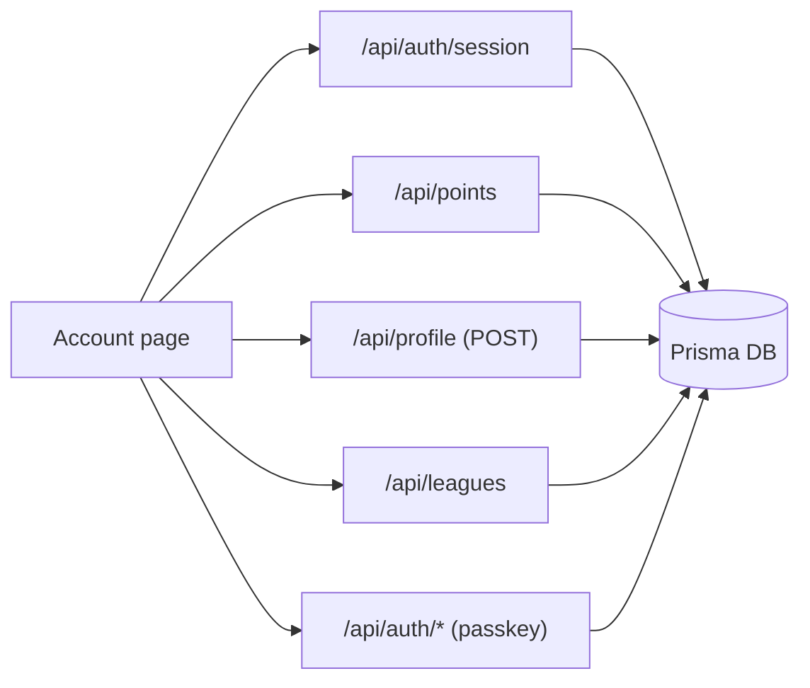
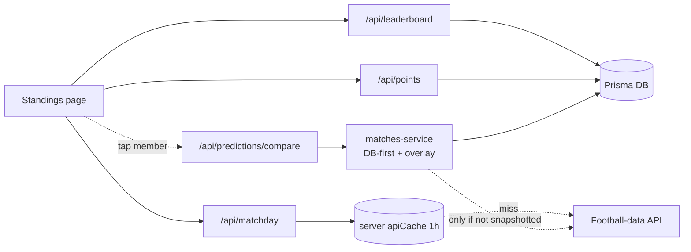
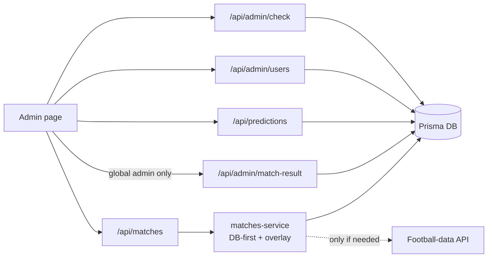

# Data Flow: Account, Standings & Admin Tabs

Companion to [`DATA_FLOW_MATCHES.md`](./DATA_FLOW_MATCHES.md). Same dual
audience:

- **Plain-English** explanations for anyone (no coding background needed).
- **🔧 Engineer notes** (call-out blocks) with the technical detail.

The app-wide fundamentals — **why every request goes through internal `/api`
routes** (API-key security + browser CORS) and the **four caching layers** —
are explained once in the Matches doc and are not repeated here. This doc
focuses on what is **unique** to each of the other three tabs.

> **Quick contrast with Matches.** The Matches tab is the one that leans on the
> external football provider. The three tabs below are almost entirely
> **database-driven** — most of their data is our own (predictions, points,
> profiles, leagues), so they rarely (Standings) or never (Account, Admin
> reads) touch the football provider.

---

## Shared header on every tab

All three pages show your points total in the header and confirm your identity.

- Plain English: each page first checks you're signed in, then shows your
  running points.

> 🔧 **Engineer note.** Every page uses `useAuth()` (→ `GET /api/auth/session`,
> Prisma `sessions`/`users`) and `usePoints()` (from `PointsProvider` →
> `GET /api/points`). `/api/points` runs a throttled, best-effort
> `refreshRecentMatchPoints()` and then returns a Prisma aggregate of
> `user_points`. Account and Standings **redirect to `/` if you're not signed
> in**.

---

## 1. Account tab (`/account`)

### What it shows

Your display name (editable), your points, your leagues, passkey setup, and
sign-out.

### Where the data comes from

- Plain English: your name and leagues are read from and written to **our
  database**. Nothing here touches the football provider.

Steps when you use the page:

1. **Edit display name** → saved to the database, then your session is refreshed
   so the new name shows everywhere.
2. **Leagues** → your leagues are listed; you can create/join, which writes to
   the database.
3. **Add a passkey** → registers a device credential for faster sign-in.
4. **Sign out** → ends your session.

> 🔧 **Engineer note.**
>
> - **Display name:** `POST /api/profile { userId, displayName }` →
>   `prisma.user.update`, then `refreshUser()` re-reads the session so
>   `user.displayName` is current. `GET /api/profile` is **self-only**
>   (`user.id !== userId → 403`).
> - **Leagues:** `LeagueManager` → `useLeagues()` → `GET /api/leagues` (Prisma
>   `league_members` + `leagues`); `POST /api/leagues` creates one.
> - **Passkey:** `registerPasskey()` runs the WebAuthn ceremony via Auth.js
>   (`/api/auth/*`), storing credentials in the `authenticators` table.
> - **No football-data call anywhere on this tab.**

---

## 2. Standings tab (`/leaderboard`)

### What it shows

The global ranking by total points, with an optional per-gameweek view, and a
tap-through to compare another member's picks.

### Where the data comes from

- Plain English: the ranking is computed from everyone's **points in our
  database**. The only external touch is the "which gameweek?" lookup, and that
  reuses the same cached value the Matches tab already fetched.

Steps:

1. **Pick the view** — "Overall" (whole season) or a specific past gameweek.
2. **The ranking loads** from the database (points totals, correct-pick counts).
3. **Past gameweeks are remembered** in the browser so switching back is instant
   (their standings can never change).
4. **Tap a member** → opens a comparison of their picks vs the results for that
   gameweek.

> 🔧 **Engineer note.**
>
> - **Ranking:** `GlobalLeaderboard` → `useLeaderboard(matchday, cacheable)` →
>   `GET /api/leaderboard` (season) or `?matchday=N`. The route does a Prisma
>   `groupBy` sum over `user_points` (top 50), joins `users`, adds
>   predicted/correct counts, and `getFinishedMatchesCount()` (read from the
>   latest `CronLog` marker — no football call). The current user is appended if
>   outside the top 50.
> - **Client cache:** `useLeaderboard` keeps a module `Map` for **past**
>   matchdays only (`cacheable = selectedMatchday < currentMatchday`); the
>   season and current-week views always refetch.
> - **Gameweek number:** `getCurrentMatchday()` reuses the **same client cache
>   shared with the Matches tab**, so opening Standings usually adds no new
>   `/api/matchday` request.
> - **Member comparison:** `MemberPicksModal` → `/api/predictions/compare` →
>   `fetchMatchesByMatchday()` (so it inherits **DB-first + overlay**) joined
>   with Prisma `user_predictions`.
> - **League leaderboards** are behind the `LEAGUE_LEADERBOARDS_ENABLED` flag
>   (currently hidden).

---

## 3. Admin tab (`/admin`)

### Who can see it

- Plain English: only **global admins** see the Admin button in the navigation.
  **League admins** can open `/admin` by typing the URL, but they can't change
  match scores.

> 🔧 **Engineer note.** Access is gated by `GET /api/admin/check`
> (`isEffectiveAdmin` = global **or** league admin). The nav **tab** is gated on
> the global `user.isAdmin` only. Full tier rules:
> [`AUTHENTICATION.md`](./AUTHENTICATION.md#admin-authorization-tiers).

### What it shows / does

Lists all users, lets an admin edit any user's predictions, and (global admins
only) enter/override final match scores.

Steps:

1. **Access check** decides whether the panel renders.
2. **User list** loads.
3. **Fixtures** load for the prediction editor.
4. **Pick a user** → their predictions load; the admin can add/edit/delete them.
5. **Match Results** (global admins only) → enter a score → it's saved as the
   source of truth and points recompute immediately.

> 🔧 **Engineer note.**
>
> - **Access:** `/api/admin/check` → `isEffectiveAdmin`. **Users list:**
>   `/api/admin/users` (effective admin) → Prisma `users`.
> - **Fixtures:** `GET /api/matches` → `matches-service` (DB-first + overlay).
> - **Prediction editing:** `GET /api/predictions?userId=…` (Prisma) then
>   `POST`/`DELETE /api/predictions`, guarded by `canActAsUser` (effective
>   admin, **unscoped** across users).
> - **Match results (global only):** `MatchResultsManager` →
>   `POST /api/admin/match-result` (`requireAdmin`) → writes a `manual`
>   `MatchResult`, then reruns `calculateMatchPoints`. See
>   [`DATA_GAP_STALE_MATCHES.md`](./DATA_GAP_STALE_MATCHES.md).

---

## Cross-tab summary

| Tab           | Main reads                                                                                            | Touches football provider?                                                        | Key DB tables                                                                                  |
| ------------- | ----------------------------------------------------------------------------------------------------- | --------------------------------------------------------------------------------- | ---------------------------------------------------------------------------------------------- |
| **Account**   | session, `/api/points`, `/api/profile`, `/api/leagues`                                                | **No**                                                                            | `users`, `user_points`, `leagues`, `league_members`, `authenticators`                          |
| **Standings** | `/api/points`, `/api/leaderboard`, `/api/matchday`, `/api/predictions/compare`                        | **Rarely** — only the shared, 1 h-cached matchday lookup; comparisons go DB-first | `user_points`, `user_predictions`, `users`                                                     |
| **Admin**     | `/api/admin/check`, `/api/admin/users`, `/api/matches`, `/api/predictions`, `/api/admin/match-result` | **Via `/api/matches`** (DB-first + overlay)                                       | `users`, `user_predictions`, `user_points`, `match_results`, `matchday_meta`, `league_members` |

> 🔧 **Engineer note.** Compared with the Matches tab, these three shift the
> centre of gravity to Prisma. The football provider is only reached indirectly
> (the shared matchday lookup, or `matches-service` when a matchday isn't fully
> snapshotted yet). Everything user-generated — predictions, points, profiles,
> leagues, and finalized results — is served from the database, our source of
> truth.

---

## One-line summary

**Account** = your profile/leagues in the database (no football provider).
**Standings** = a points ranking computed from the database (+ one shared,
cached matchday lookup). **Admin** = database management tools (users,
predictions) plus a global-admin-only path to set final scores. The Matches tab
([its own doc](./DATA_FLOW_MATCHES.md)) is where the external provider is
actually used.
