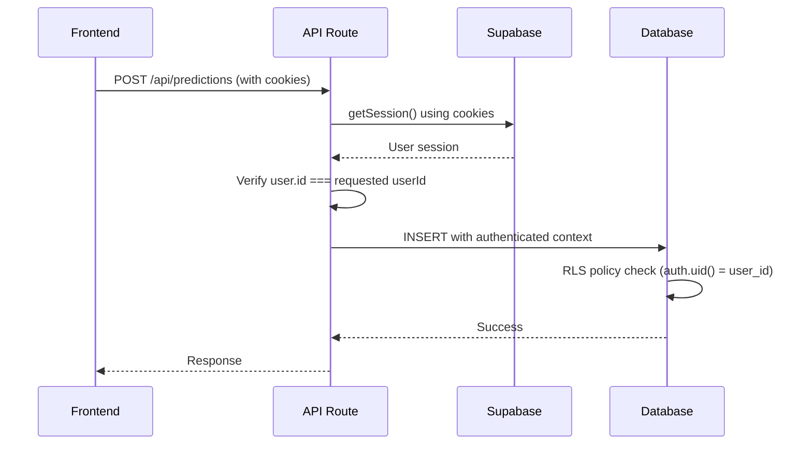

# Row Level Security (RLS) Error Resolution

## The Error

```
"new row violates row-level security policy for table user_predictions"
```

## What This Means

**Row Level Security (RLS)** is a PostgreSQL security feature that Supabase enables by default. It ensures that users can only access and modify data they're authorized to see.

The error occurs when:

1. RLS is enabled on a table (which is good for security)
2. There are policies defined that control access
3. The current database operation doesn't meet the policy requirements

## The Problem in Our Case

Our `user_predictions` table had:

- ✅ RLS enabled (good for security)
- ✅ A policy: "Users can manage their own predictions"
- ❌ API routes that weren't properly authenticating users

The policy uses `auth.uid()` to check if the current user matches the `user_id` field, but our API routes weren't passing the user authentication context to Supabase.

## The Solution

### 1. Updated API Routes (`/src/app/api/predictions/route.js`)

- **Before**: Used direct Supabase client without user context
- **After**: Used `@supabase/ssr` to create authenticated server client
- **Added**: User session verification in each API endpoint
- **Added**: Authorization checks to ensure users can only access their own data

### 2. Updated Client Configuration (`/src/lib/supabase.js`)

- **Upgraded**: From `@supabase/supabase-js` to `@supabase/ssr`
- **Improved**: Better SSR (Server-Side Rendering) support
- **Enhanced**: Automatic session management

## How Authentication Now Works



## Key Security Benefits

1. **User Isolation**: Users can only access their own predictions
2. **Authentication Required**: All operations require valid login
3. **Authorization Checks**: API verifies user permissions
4. **Database-Level Security**: RLS provides final security layer

## Environment Requirements

Make sure these environment variables are set:

```bash
NEXT_PUBLIC_SUPABASE_URL=your_supabase_project_url
NEXT_PUBLIC_SUPABASE_ANON_KEY=your_supabase_anon_key
```

## Testing the Fix

1. **With Authentication**: Users should be able to save/load predictions
2. **Without Authentication**: API should return 401 Unauthorized
3. **Cross-User Access**: Users cannot access other users' predictions

## Database Schema Reminder

The RLS policy in our schema:

```sql
CREATE POLICY "Users can manage their own predictions" ON user_predictions
FOR ALL USING (auth.uid() = user_id);
```

This ensures that:

- `auth.uid()` gets the current authenticated user's ID
- Only rows where `user_id` matches the authenticated user are accessible
- Works for SELECT, INSERT, UPDATE, and DELETE operations
